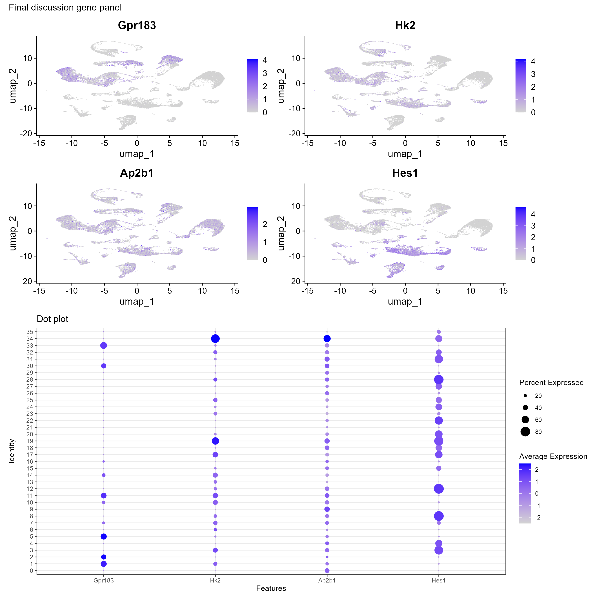
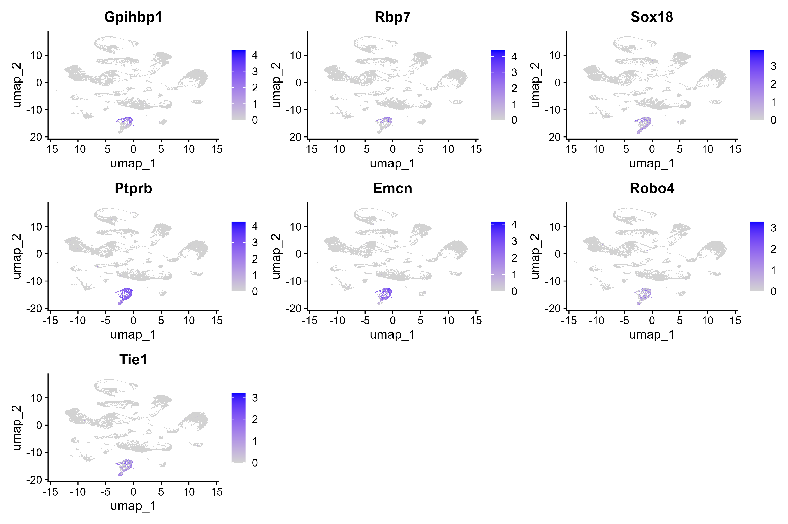
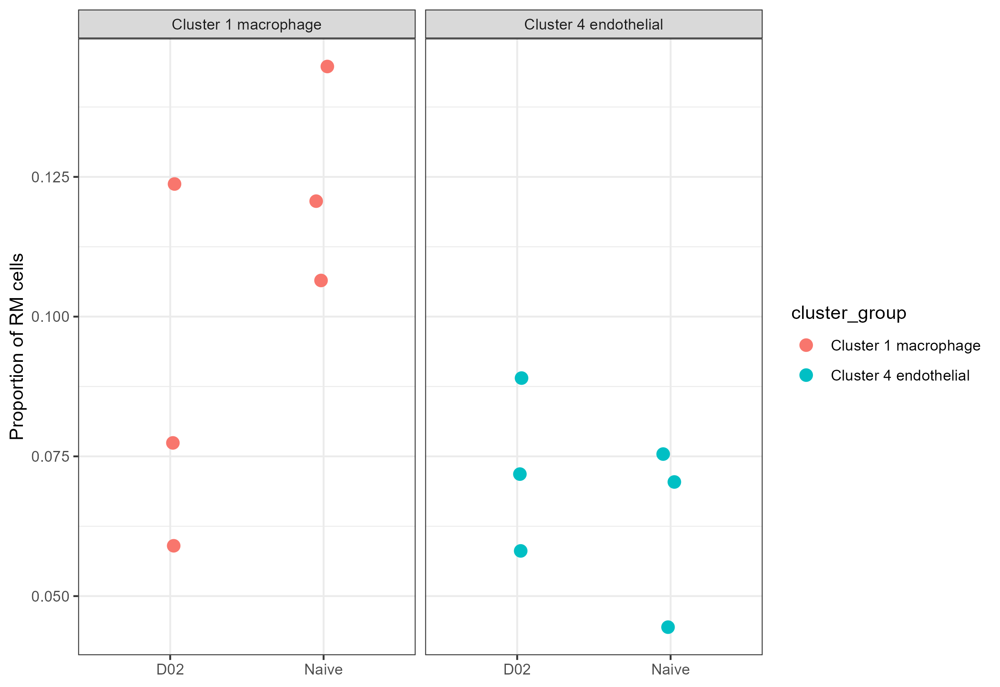

# BINF6110 Assignment 4: scRNA-seq analysis of influenza-restricted nasal mucosa

## Introduction

In this analysis, a Seurat object derived from a mouse influenza infection study of the nasal mucosa was analyzed. The dataset includes multiple nasal compartments, multiple timepoints after infection, and mouse-level metadata, making it suitable for clustering, annotation, and cluster-specific differential expression analysis.

The main goals of this analysis were to identify major cell populations in the dataset, annotate clusters using both automated and marker-based approaches, and evaluate transcriptional changes within at least one cluster across experimental groups. The primary downstream comparison focused on a macrophage-supported cluster in respiratory mucosa (RM), comparing early infection (D02) with baseline (Naive). A second, more cleanly annotated endothelial cluster was also analyzed as a supporting comparison.

## Methods

## Repository structure

- `data/` — processed Seurat objects and intermediate R objects  
- `scripts/` — analysis scripts  
- `results/figures/` — generated figures used in the README/report  
- `results/tables/` — output tables, marker tables, and DE results  
- `renv/` and `renv.lock` — project-local package environment  

### Data input and project setup

The analysis was performed in RStudio within an `renv`-managed project environment.

The main processed object generated during analysis was:

-   `data/seurat_ass4_lognorm_clustered.rds`

### Quality control and preprocessing

The initial object was inspected for metadata structure, tissue distribution, and timepoint distribution. Mitochondrial percentage was calculated using the mouse-appropriate `^mt-` prefix. Quality control was assessed using violin plots and scatter plots of `nFeature_RNA`, `nCount_RNA`, and `percent.mt`. Cells with missing `mouse_id`, fewer than 200 detected features, or mitochondrial fraction greater than 20% were removed.

A log-normalization workflow was employed, consisting of `NormalizeData()`, `FindVariableFeatures()`, `ScaleData()` with `percent.mt` regressed out, `RunPCA()`, `FindNeighbors()`, `FindClusters()`, and `RunUMAP()`. Clustering yielded 36 clusters. Harmony or another integration method was considered but not applied, because the UMAP showed biologically structured clustering rather than strong sample-driven separation.

### Cluster annotation

Cluster annotation was performed using two complementary approaches. First, Seurat marker detection was used to identify cluster-enriched genes. Second, SingleR was run at the cluster level using `MouseRNAseqData()` as the reference. Marker-based feature plots were then used to validate broad biological compartments, including neuronal, endothelial, myeloid/macrophage, stromal/fibroblast, and epithelial populations. The final labels were kept broad, since this level of annotation was best supported by both the marker evidence and the reference-based labels.

### Differential expression design

For downstream analysis, **cluster 1** was selected as the primary case study because both marker genes and SingleR supported a macrophage identity, and the RM Naive versus D02 comparison provided balanced mouse-level replication with adequate cell numbers per mouse. As a supporting comparison, **cluster 4** was analyzed because it showed a cleaner endothelial identity supported by both marker genes and SingleR.

Cluster-specific differential expression was performed using a **pseudobulk** workflow. Cells were subset by cluster, tissue, and timepoint, then aggregated by `mouse_id` using `AggregateExpression()`. Mouse identity was used as the biological replicate unit. Differential expression was performed with DESeq2 using the design `~ time`, with the main contrast defined as **D02 vs Naive**, so positive log2 fold change indicates higher expression in D02 and negative log2 fold change indicates higher expression in Naive. Log2 fold changes were then shrunk using `apeglm`, and MA and volcano plots were generated. Because many top-ranked genes in the full DE tables were ribosomal or mitochondrial, filtered interpretation tables excluding genes beginning with `Rpl`, `Rps`, and `mt-` were generated in addition to the full official DE tables.

### Functional analysis

Functional interpretation was performed using ORA and GSEA with `clusterProfiler` and `org.Mm.eg.db`. ORA was run on filtered sets of upregulated genes, while GSEA was run on the full ranked shrunk log2 fold change list after gene symbol to Entrez ID mapping. This allowed both threshold-based and ranked-list-based views of cluster-specific transcriptional change.

## Results

 The dataset separated into 36 clusters with clear broad biological structure, after filtering and log-normalization-based clustering. Marker-based visualization and SingleR supported major compartments including neurons, macrophages, endothelial cells, fibroblasts, epithelial cells, B cells, T cells, NK cells, monocytes, and granulocytes. Broad labels were retained in the main interpretation to avoid overclaiming fine subtypes.

**Figure 1. Broad SingleR-supported annotation of the clustered dataset.** UMAP of the filtered single-cell dataset colored by pruned SingleR cluster labels. The plot shows broad compartment-level structure across neuronal, myeloid, endothelial, stromal, epithelial, and lymphoid populations.

**Figure 2. Marker-based validation of broad cluster identities.** Combined marker panel used to validate broad biological compartments in the dataset. Representative neuronal, endothelial, macrophage/myeloid, stromal, and epithelial markers were used to support the conservative annotation strategy.

### Main downstream comparison: cluster 1 macrophages in RM, D02 vs Naive

Cluster 1 was selected as the primary case study because both marker genes and SingleR supported a macrophage identity, and the RM Naive versus D02 comparison retained three biological replicates per group with adequate cell counts in each mouse. Within RM cluster 1, D02 mouse-level counts were 449, 193, and 208 cells, while Naive counts were 481, 321, and 264 cells.

Pseudobulk DESeq2 analysis identified a substantial transcriptional shift in this cluster. In the cluster 1 RM comparison:

- **932 genes** had `padj < 0.05`
- **131 genes** had `padj < 0.05` and `|log2FC| > 1`
- **104 genes** were up in D02
- **27 genes** were up in Naive

Many of the most statistically extreme genes in the unfiltered result table were ribosomal or mitochondrial, so interpretation emphasized filtered, more biologically interpretable genes. Examples of D02-up genes retained in interpretation included **Plek**, **Ap2a2**, and **Ap2b1**.

ORA on filtered D02-up genes produced a narrow GO Cellular Component signal centered on **clathrin adaptor complex** and **clathrin vesicle coat**, driven mainly by **Ap2a2**, **Ap2b1**, and **Ap1s2**. GSEA produced a broader functional pattern. Naive-up enrichment included translation-associated processes, oxidative phosphorylation, respiratory electron transport, and antigen processing/presentation, whereas D02-up enrichment included ion transport, carbohydrate metabolic process, extracellular matrix assembly, and export across the plasma membrane.

**Figure 3. MA plot for cluster 1 RM macrophages, D02 vs Naive.** Mean expression is plotted against shrunk log2 fold change for pseudobulk differential expression in cluster 1 macrophages from RM. The plot shows a broad distribution of differential expression rather than a null comparison.

**Figure 4. Shrunk volcano plot for cluster 1 RM macrophages, D02 vs Naive.** Differential expression results after log2 fold-change shrinkage. This plot highlights the magnitude and significance of transcriptional differences while reducing noise from low-count genes.

**Figure 5. ORA of filtered D02-up genes from cluster 1 RM macrophages.** GO Cellular Component over-representation analysis showed a narrow enrichment signal centered on clathrin adaptor and vesicle-coat-associated terms rather than broad process-level themes.

**Figure 6. Expression of selected genes in the two focal clusters.** Violin plots showing representative genes used to compare the macrophage-focused cluster 1 and endothelial-focused cluster 4. These plots support the contrasting biological interpretation of the two downstream case studies.

### Supporting comparison: cluster 4 endothelial cells in RM, D02 vs Naive

Cluster 4 was analyzed as a supporting comparison because it showed a cleaner endothelial identity than cluster 1. Marker genes and SingleR both supported this interpretation.

The RM cluster 4 pseudobulk comparison also produced a valid differential expression result:

- **637 genes** had `padj < 0.05`
- **111 genes** had `padj < 0.05` and `|log2FC| > 1`
- **107 interpretable strong-effect genes** remained after excluding ribosomal and mitochondrial genes
- **82 strong-effect genes** were up in D02
- **29 strong-effect genes** were up in Naive

Interpretable D02-up genes included **Hes1**, **Cd200**, and **Nmt1**. However, the enrichment narrative was narrower than in cluster 1. GO Biological Process and Molecular Function ORA returned no significant terms, while GO Cellular Component again suggested a small clathrin/AP-2-associated signal. GSEA was also more limited, with **mitochondrial translation** enriched on the Naive-up side.

These results made cluster 4 useful as a cleaner supporting comparison, but less biologically rich than cluster 1.

**Figure 7. Endothelial marker validation for cluster 4.** Feature plots showing canonical endothelial markers used to support cluster 4 as an endothelial population.

**Figure 8. Volcano plot for cluster 4 RM endothelial cells, D02 vs Naive.** Pseudobulk differential expression results for the endothelial-focused supporting comparison.

**Figure 9. ORA of filtered D02-up genes from cluster 4 RM endothelial cells.** GO Cellular Component over-representation analysis for cluster 4 showed a narrower enrichment profile than cluster 1, again dominated by vesicle/clathrin-associated terms.

### Descriptive cell composition analysis

A descriptive composition analysis was also used to compare the relative abundance of **cluster 1 macrophages** and **cluster 4 endothelial cells** among RM cells in Naive and D02 samples. This was treated as a visual summary rather than a formal statistical compositional test.

The plot suggested a larger between-group shift for cluster 1 macrophages than for cluster 4 endothelial cells, consistent with the stronger biological signal recovered in the cluster 1 transcriptional analysis.

**Figure 10. Per-mouse proportions of focal RM clusters in Naive and D02 samples.** Points represent individual mice, and black diamonds represent the group mean of the per-mouse proportions. Cluster 1 macrophages show the larger descriptive shift between groups, whereas cluster 4 endothelial cells show a smaller relative-abundance difference.

## Discussion

The primary conclusion of this analysis is that cluster-specific pseudobulk differential expression recovered meaningful transcriptional changes associated with early infection while preserving biological replication at the mouse level. Cluster 1 macrophages in RM showed the strongest overall case study: the differential expression signal was substantial, the filtered gene list contained interpretable genes, and the enrichment analyses supported changes related to membrane trafficking, transport, extracellular-matrix-associated processes, and mitochondrial or translation-linked programs. Although many top-ranked genes in the full result table were ribosomal or mitochondrial, the combined DE, ORA, and GSEA results support the interpretation that this cluster underwent a real transcriptional state shift between Naive and D02

Cluster 4 endothelial cells helped contextualize the macrophage result. This cluster was easier to annotate, but its enrichment output was narrower and less biologically rich. This contrast was informative because it showed that a cleaner cluster identity did not necessarily produce a stronger pathway-level signal. For this reason, cluster 1 remained the more useful main case study for the assignment, while cluster 4 strengthens the analysis.

Several limitations should also be noted. First, the final cluster annotations were intentionally broad because the dataset and reference-based methods did not justify fine subtype claims with high confidence. Second, local memory limitations prevented SCTransform from being used in the final pipeline, so a log-normalization workflow was adopted instead. Third, many highly ranked DE genes were not ideal narrative anchors, making filtered interpretation tables and pathway-level summaries more informative than raw ranking alone. Finally, enrichment results were uneven across clusters, so the biological interpretation relies on the overall pattern across DE, ORA, and GSEA rather than any single result table.

## References

