# BINF6110 Assignment 4: scRNA-seq analysis of influenza-restricted nasal mucosa

## Introduction

Influenza A virus is a major respiratory pathogen that commonly establishes infection in the upper respiratory tract, where host defense depends on multiple responses, including mucosal barriers, epithelial antiviral signaling, and the rapid recruitment of innate and adaptive immune responses (Mifsud et al., 2021). The virus first encounters host tissues at the nasal mucosa, where early immune and stromal responses can shape viral control and local tissue remodeling (Kazer et al., 2024). 

In this analysis, a Seurat object derived from a mouse influenza infection study of the nasal mucosa was analyzed. The dataset includes multiple nasal compartments, multiple timepoints after infection, and mouse-level metadata, making it suitable for clustering, annotation, and cluster-specific differential expression analysis (Kazer et al., 2024).

Several analytical choices are available for single cell RNA-sequencing workflows, each with their own trade-offs. Seurat is a widely used framework for single-cell quality control, normalization, clustering, dimensional reduction, and visualization, highlighting it as a practical choice for this analysis (Hao et al., 2024). For cluster annotation, both manual marker-based interpretation and automated reference-based methods are available (Clarke et al., 2021). Manual annotation offers direct biological control but can be difficult when clusters are closely related, whereas automated tools such as SingleR provide systematic reference-based labeling that can then be validated with marker genes. Benchmarking studies have shown that Seurat- and SingleR-based strategies both perform well overall, with SingleR remaining competitive for similar cell types and downsampled data (Huang et al., 2021). Differential expression analysis in scRNA-seq also requires a choice between cell-level and replicate-level strategies. Cell-level approaches model individual-cell variation directly, but replicate-aware pseudobulk approaches such as through DESEq2 (Love et al., 2014) are often preferred when biological replication is available because they reduce pseudoreplication, i.e. using inferential statistics where replicates are not statistically independent (Zimmerman et al., 2021) and perform well in benchmark comparisons (Murphy & Skene, 2022).

Thus, the Seurat object of interest was further analysed through a workflow that involved SingleR along with marker validation for annotation, and pseudobulk DESeq2 for cluster-specific differential expression. Over-Representation Analysis (ORA) and Gene Set Enrichment Analysis (GSEA) (Subramanian et al., 2005) were both employed for functional interpretation, being two widely used methods (Geistlinger et al., 2021)

The main goals of this analysis were to identify major cell populations in the dataset, annotate clusters using both automated and marker-based approaches, and evaluate transcriptional changes within at least one cluster across experimental groups. The primary downstream comparison focused on a macrophage-supported cluster in respiratory mucosa (RM), comparing early infection (D02) with baseline (Naive). A second, more cleanly annotated endothelial cluster was also analyzed as a supporting comparison.

## Methods

## Repository structure

- `data/` — processed Seurat objects and intermediate R objects  
- `scripts/` — analysis scripts  
- `results/figures/` — generated figures used in the README/report  
- `results/tables/` — output tables, marker tables, and DE results  
- `renv/` and `renv.lock` — project-local package environment  

### Data input and project setup

The analysis was performed in RStudio(v.4.5.1) within an `renv`-managed project environment. 

The main processed object generated during analysis was:

-   `data/seurat_ass4_lognorm_clustered.rds`

### Quality control and preprocessing

Seurat version 5.4.0 was employed. The initial object was inspected for metadata structure, tissue distribution, and timepoint distribution. Mitochondrial percentage was calculated using the mouse-appropriate `^mt-` prefix. Quality control was assessed using violin plots and scatter plots of `nFeature_RNA`, `nCount_RNA`, and `percent.mt`. Cells with missing `mouse_id`, fewer than 200 detected features, or mitochondrial fraction greater than 20% were removed.

A log-normalization workflow was employed, consisting of `NormalizeData()`, `FindVariableFeatures()`, `ScaleData()` with `percent.mt` regressed out, `RunPCA()`, `FindNeighbors()`, `FindClusters()`, and `RunUMAP()`. Clustering yielded 36 clusters. Harmony as an integration method (Korsunsky et al., 2019) was considered but not applied, because the UMAP showed biologically structured clustering rather than strong sample-driven separation.

### Cluster annotation

Cluster annotation was performed using two complementary approaches. First, Seurat marker detection was used to identify cluster-enriched genes. Second, SingleR was run at the cluster level using `MouseRNAseqData()` as the reference. Marker-based feature plots were then used to validate broad biological compartments, including neuronal, endothelial, myeloid/macrophage, stromal/fibroblast, and epithelial populations. The final labels were kept broad, since this level of annotation was best supported by both the marker evidence and the reference-based labels.

### Differential expression design

For downstream analysis, **cluster 1** was selected as the primary case study because both marker genes and SingleR supported a macrophage identity, and the RM Naive versus D02 comparison provided balanced mouse-level replication with adequate cell numbers per mouse. As a supporting comparison, **cluster 4** was analyzed because it showed a cleaner endothelial identity supported by both marker genes and SingleR.

Cluster-specific differential expression was performed using a **pseudobulk** workflow. Cells were subset by cluster, tissue, and timepoint, then aggregated by `mouse_id` using `AggregateExpression()`. Mouse identity was used as the biological replicate unit. Differential expression was performed with DESeq2(v.1.50.2) using the design `~ time`, with the main contrast defined as **D02 vs Naive**, so positive log2 fold change indicates higher expression in D02 and negative log2 fold change indicates higher expression in Naive. Log2 fold changes were then shrunk using `apeglm`(v.1.32.0) (Zhu et al., 2019), and MA and volcano plots were generated. Because many top-ranked genes in the full DE tables were ribosomal or mitochondrial, filtered interpretation tables excluding genes beginning with `Rpl`, `Rps`, and `mt-` were generated in addition to the full official DE tables.

### Functional analysis

Functional interpretation was performed using ORA and GSEA with `clusterProfiler`(v.4.18.4) (Xu et al., 2024) and `org.Mm.eg.db`(v.3.22.0) (Carlson, 2017) . ORA was run on filtered sets of upregulated genes, while GSEA was run on the full ranked shrunk log2 fold change list after gene symbol to Entrez ID mapping. This allowed both threshold-based and ranked-list-based views of cluster-specific transcriptional change.

## Results

 The dataset separated into 36 clusters with clear broad biological structure, after filtering and log-normalization-based clustering. Marker-based visualization and SingleR supported major compartments including neurons, macrophages, endothelial cells, fibroblasts, epithelial cells, B cells, T cells, NK cells, monocytes, and granulocytes. Broad labels were retained in the main interpretation to avoid overclaiming fine subtypes (Figure 1 and 2).

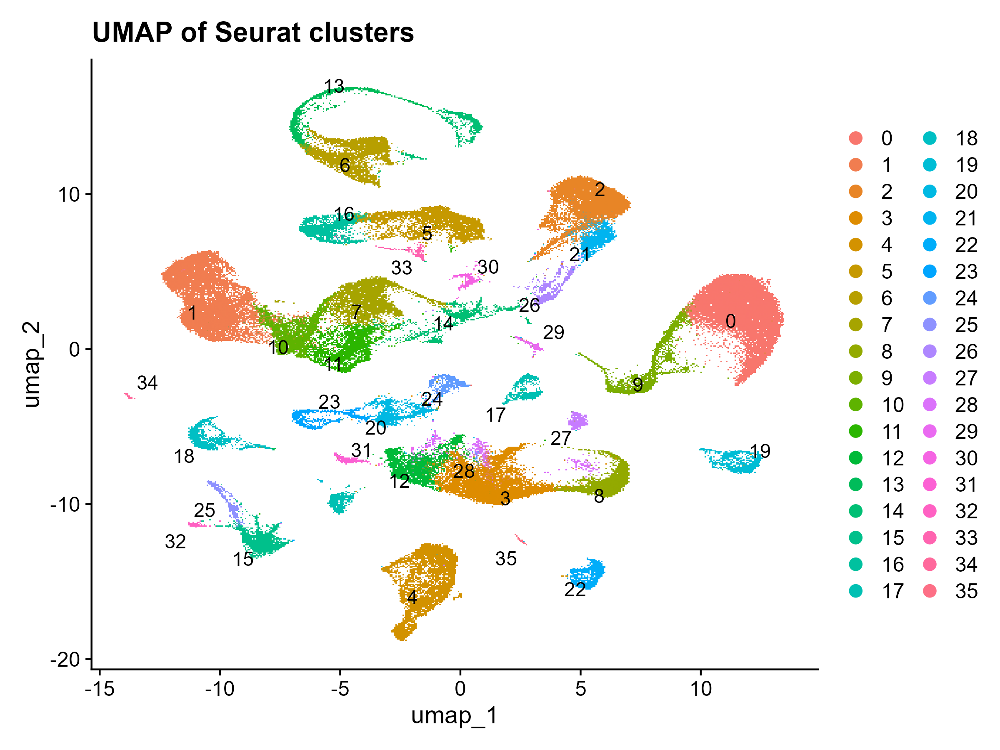

**Figure 1. UMAP of the clustered dataset.** UMAP of the filtered single-cell RNA-seq dataset after log-normalization, PCA, neighbor graph construction, and clustering in Seurat. Cells are colored by Seurat cluster identity, and numeric labels indicate the 36 clusters used for downstream annotation and comparison. 

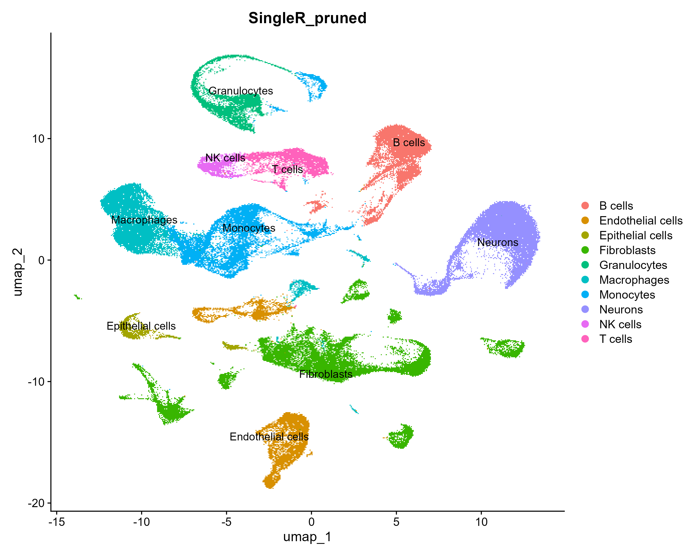

**Figure 2. Broad SingleR-supported annotation of the clustered dataset.** UMAP of the filtered single-cell dataset colored by pruned SingleR cluster labels. The plot shows broad compartment-level structure across neuronal, myeloid, endothelial, stromal, epithelial, and lymphoid populations.

### Main downstream comparison: cluster 1 macrophages in RM, D02 vs Naive

In Cluster 1, the RM Naive versus D02 comparison retained three biological replicates per group with adequate cell counts in each mouse. Within RM cluster 1, D02 mouse-level counts were 449, 193, and 208 cells, while Naive counts were 481, 321, and 264 cells.

Pseudobulk DESeq2 analysis identified a substantial transcriptional shift in this cluster. In the cluster 1 RM comparison:

- **932 genes** had `padj < 0.05`
- **131 genes** had `padj < 0.05` and `|log2FC| > 1`
- **104 genes** were up in D02
- **27 genes** were up in Naive

Many of the most statistically extreme genes in the unfiltered result table were ribosomal or mitochondrial, so interpretation emphasized filtered, more biologically interpretable genes. 

ORA on filtered D02-up genes produced a narrow GO Cellular Component signal centered on **clathrin adaptor complex** and **clathrin vesicle coat**, driven mainly by **Ap2a2**, **Ap2b1**, and **Ap1s2** (Figure 5). GSEA produced a broader functional pattern (Figure 6). Naive-up enrichment included translation-associated processes, oxidative phosphorylation, respiratory electron transport, and antigen processing/presentation, whereas D02-up enrichment included ion transport, carbohydrate metabolic process, extracellular matrix assembly, and export across the plasma membrane.

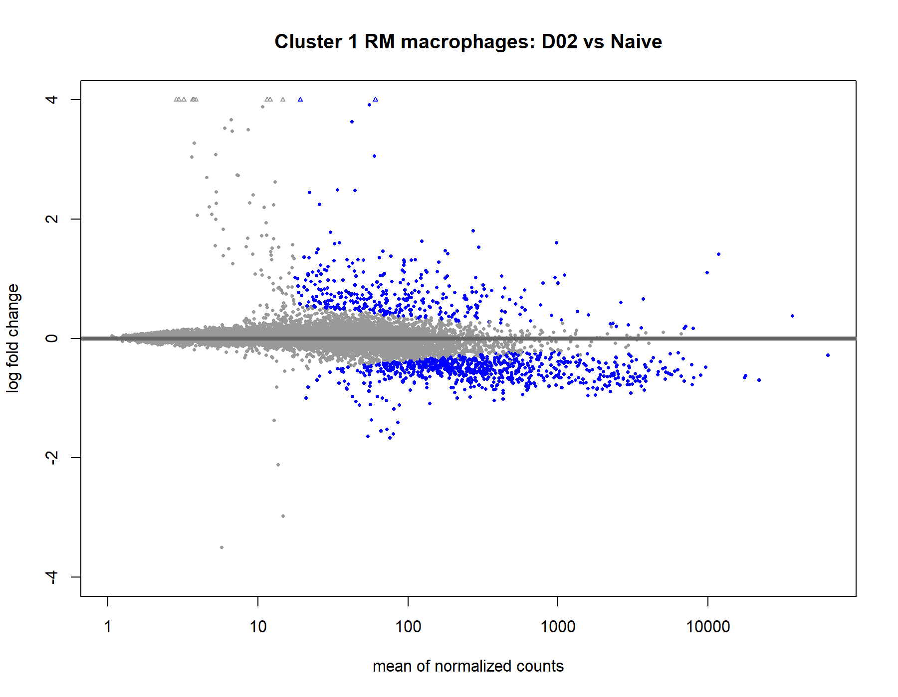

**Figure 3. MA plot for cluster 1 RM macrophages, D02 vs Naive.** Mean expression is plotted against shrunk log2 fold change for pseudobulk differential expression in cluster 1 macrophages from RM. The plot shows a broad distribution of differential expression rather than a null comparison.

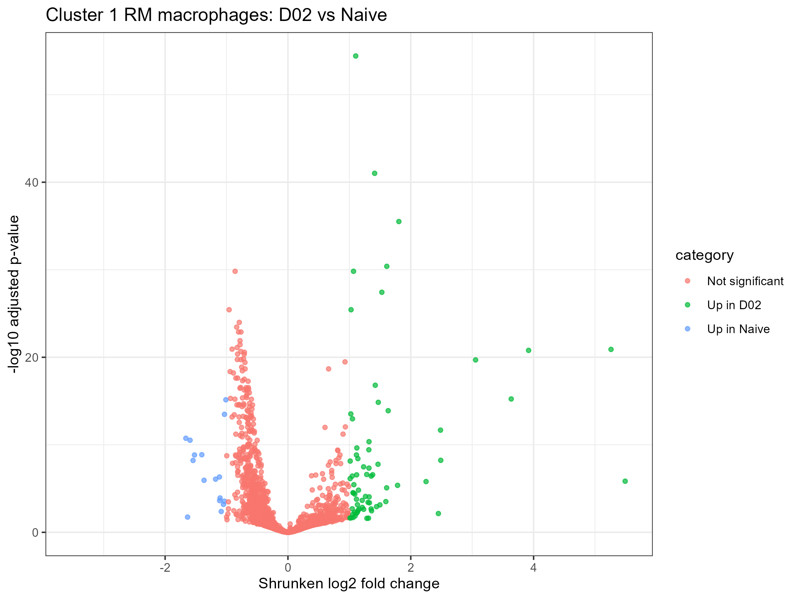

**Figure 4. Shrunk volcano plot for cluster 1 RM macrophages, D02 vs Naive.** Differential expression results after log2 fold-change shrinkage. This plot highlights the magnitude and significance of transcriptional differences while reducing noise from low-count genes.

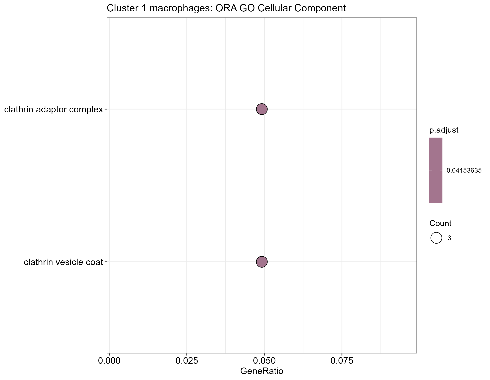

**Figure 5. ORA of filtered D02-up genes from cluster 1 RM macrophages.** GO Cellular Component over-representation analysis showed a narrow enrichment signal centered on clathrin adaptor and vesicle-coat-associated terms rather than broad process-level themes.

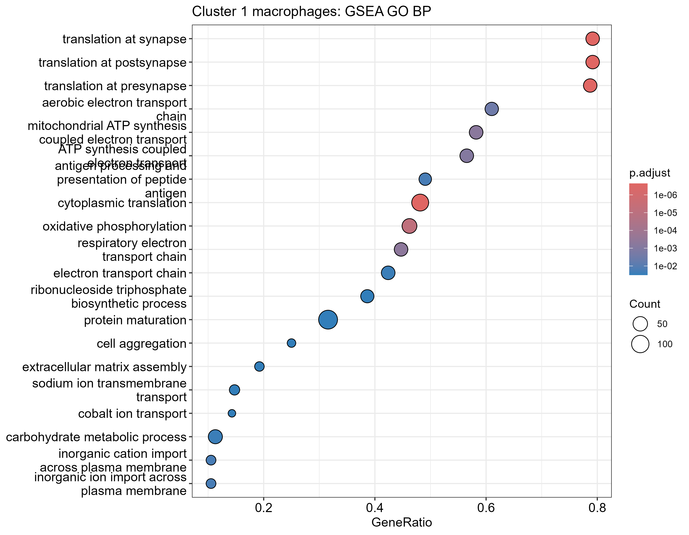

**Figure 5. GSEA of cluster 1 RM macrophages, D02 vs Naive.**  Dot plot of GO Biological Process gene set enrichment analysis for ranked pseudobulk differential-expression results from cluster 1 macrophages in respiratory mucosa. This comparison showed a broader enrichment pattern than cluster 4, with terms spanning translation-associated processes, electron transport and oxidative phosphorylation, antigen presentation, extracellular matrix assembly, and ion or carbohydrate transport

### Supporting comparison: cluster 4 endothelial cells in RM, D02 vs Naive

Cluster 4 was analyzed as a supporting comparison because it showed a cleaner endothelial identity than cluster 1. Marker genes and SingleR both supported this interpretation.

The RM cluster 4 pseudobulk comparison also produced a valid differential expression result:

- **637 genes** had `padj < 0.05`
- **111 genes** had `padj < 0.05` and `|log2FC| > 1`
- **107 interpretable strong-effect genes** remained after excluding ribosomal and mitochondrial genes
- **82 strong-effect genes** were up in D02
- **29 strong-effect genes** were up in Naive

Interpretable D02-up genes included **Hes1** and **Cd200**. However, the enrichment narrative was narrower than in cluster 1. GO Biological Process and Molecular Function ORA returned no significant terms, while GO Cellular Component again suggested a small clathrin/AP-2-associated signal (Figure 9). GSEA was also more limited, with **mitochondrial translation** enriched on the Naive-up side (Figure 10).

These results made cluster 4 useful as a cleaner supporting comparison, but less biologically rich than cluster 1.

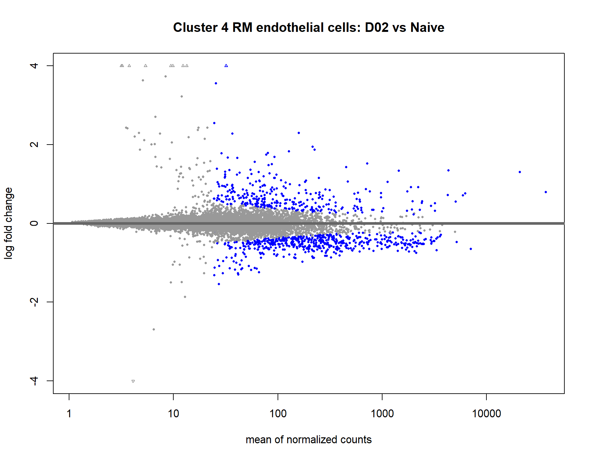

**Figure 7. MA plot for cluster 4 RM endothelial cells, D02 vs Naive** . MA plot of pseudobulk DESeq2 results for cluster 4 endothelial cells from respiratory mucosa comparing D02 and Naive samples. Each point represents one gene, with significant genes highlighted, showing a detectable but more limited transcriptional shift than in the cluster 1 macrophage comparison.

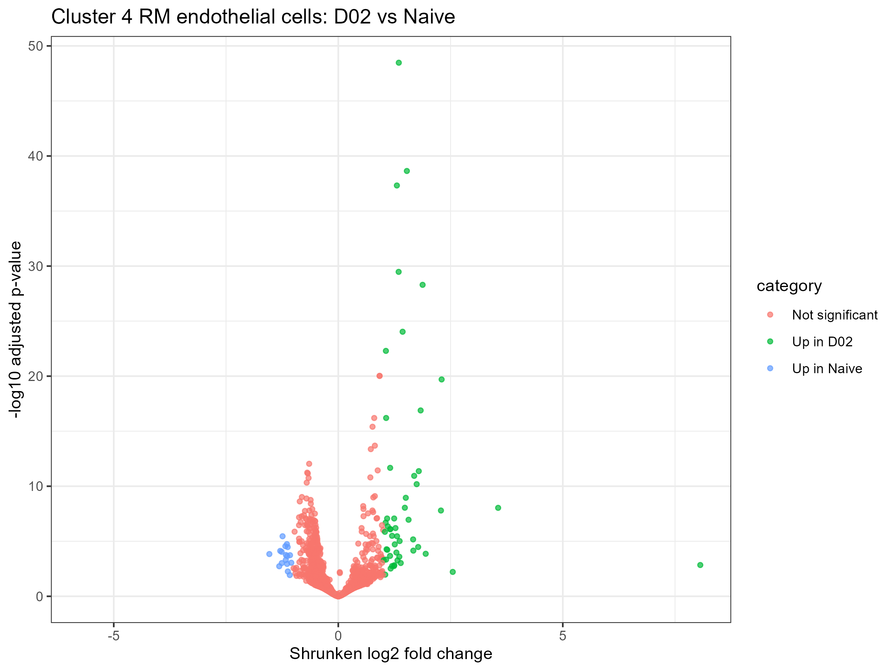

**Figure 8. Volcano plot for cluster 4 RM endothelial cells, D02 vs Naive.** Pseudobulk differential expression results for the endothelial-focused supporting comparison.

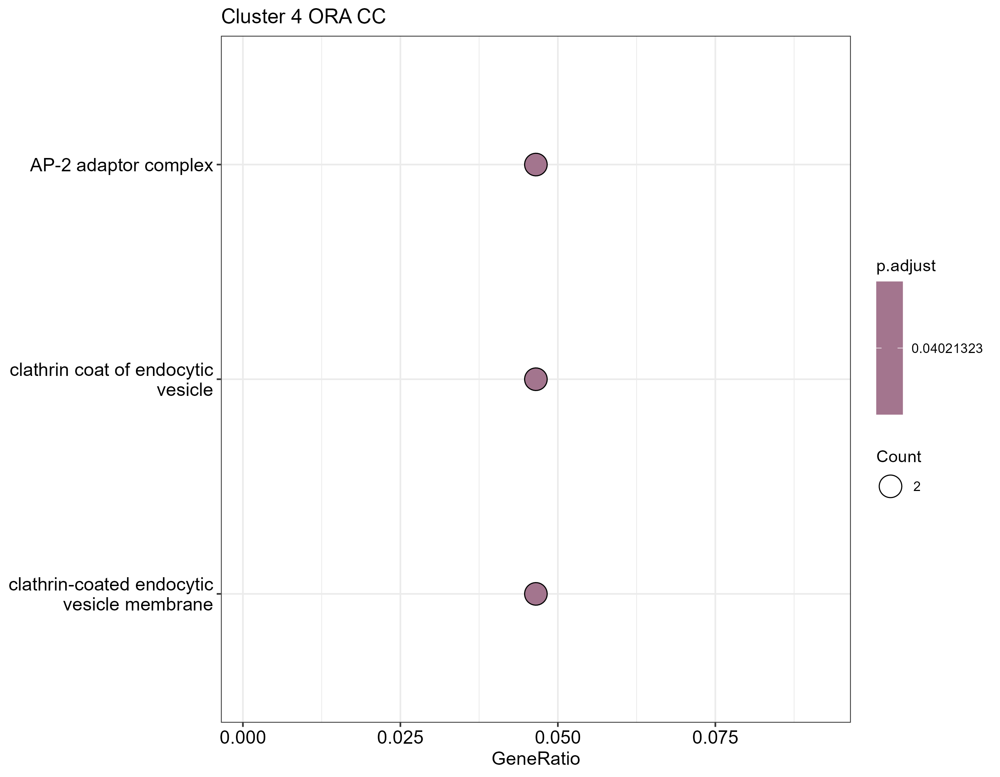

**Figure 9. ORA of filtered D02-up genes from cluster 4 RM endothelial cells.** GO Cellular Component over-representation analysis for cluster 4 showed a narrower enrichment profile than cluster 1, again dominated by vesicle/clathrin-associated terms.

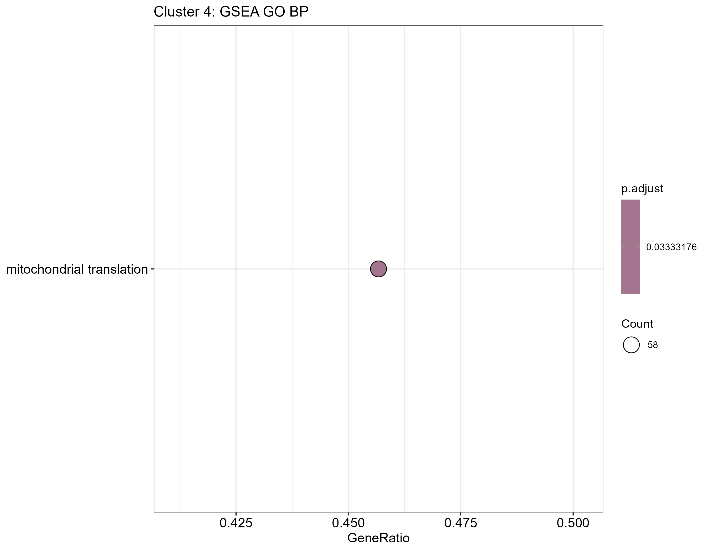

**Figure 10.GSEA of cluster 4 RM endothelial cells, D02 vs Naive.**
Dot plot of GO Biological Process gene set enrichment analysis for ranked pseudobulk differential-expression results from cluster 4 endothelial cells in respiratory mucosa. In contrast to cluster 1, cluster 4 produced a limited enrichment profile, with mitochondrial translation as the only significant GO Biological Process term.

### Descriptive cell composition analysis

A descriptive composition analysis was also used to compare the relative abundance of **cluster 1 macrophages** and **cluster 4 endothelial cells** among RM cells in Naive and D02 samples. This was treated as a visual summary rather than a formal statistical compositional test (Figure 9).

The plot suggested a larger between-group shift for cluster 1 macrophages than for cluster 4 endothelial cells, consistent with the stronger biological signal recovered in the cluster 1 transcriptional analysis.

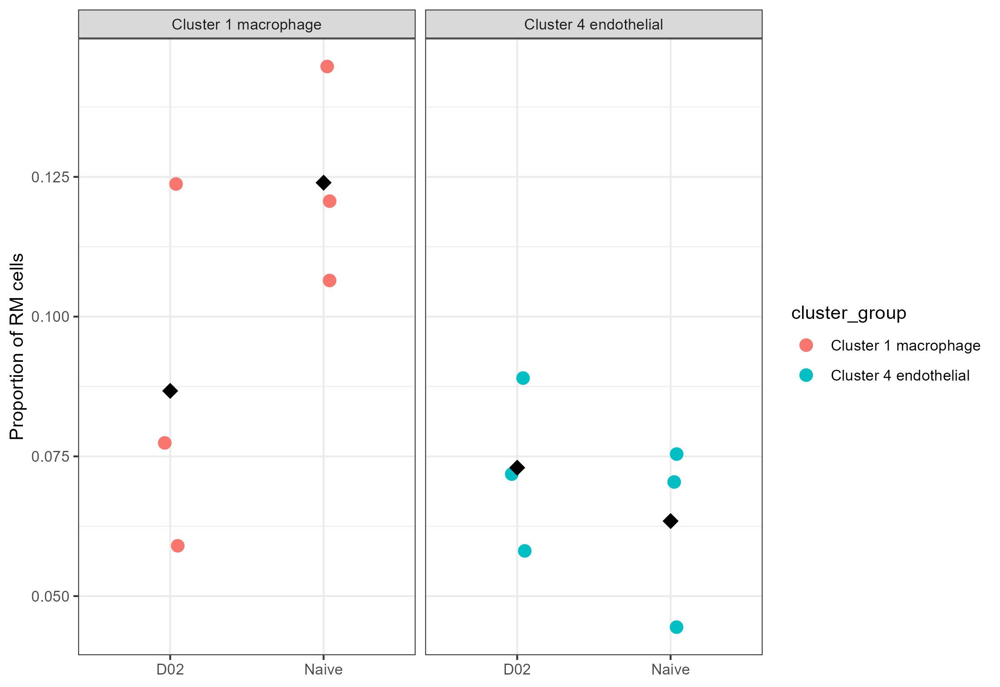

**Figure 9. Per-mouse proportions of focal RM clusters in Naive and D02 samples.** Points represent individual mice, and black diamonds represent the group mean of the per-mouse proportions. Cluster 1 macrophages show the larger descriptive shift between groups, whereas cluster 4 endothelial cells show a smaller relative-abundance difference.

### Genes chosen for discussion 

 Among the D02-up genes in cluster 1, **Gpr183**, **Hk2**, **Ap2a2**, and **Ap2b1** were found to be interpretable in the context of infection-associated macrophage biology and the enrichment results. In cluster 4, **Hes1** and **Cd200** seemed to both have clearer endothelial relevance in the literature than many of the other significant genes.

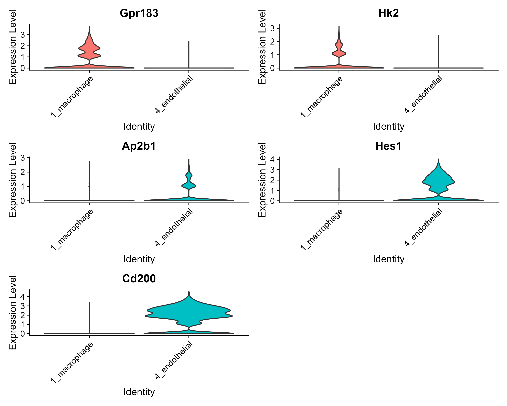

**Figure 10. Expression of selected genes in the two focal clusters.** Violin plots showing representative genes used to compare the macrophage-focused cluster 1 and endothelial-focused cluster 4. These plots support the contrasting biological interpretation of the two downstream case studies.

## Discussion

The primary conclusion of this analysis is that cluster-specific pseudobulk differential expression recovered meaningful transcriptional changes associated with early infection while preserving biological replication at the mouse level. 

The primary case study in this analysis was cluster 1, which was supported as a macrophage-like cluster by both marker-based inspection and SingleR. Macrophages are cells that are implicated in immune response upon injury or infection, as well as tissue development and homeostasis (Kierdorf et al., 2015). This cluster showed a richer transcriptional response in the RM D02 versus Naive comparison. This contrast yielded a substantial differential expression signal and broader GSEA support than the supporting endothelial comparison (cluster 4). Taken together, these results support the interpretation that RM macrophages did in fact undergo a transcriptional state shift between baseline and early infection. 

Among the differentially expressed genes in this cluster, Gpr183 is a plausible anchor gene. There is literature wherein GPR183 signaling has been experimentally linked to macrophage infiltration and inflammatory responses during influenza and SARS-CoV-2 infection (Foo et al., 2023). In the context of the present dataset, its differential expression is thus compatible with an early infection-associated myeloid response. This could warrant further exploration of analyses that directly test macrophage trafficking or receptor signaling.

Hk2 also seems to be biologically linked to the D02-up macrophage state. Influenza A infection has been shown to induce glycolytic reprogramming, including increased expression of glycolysis-associated machinery such as HK2 proteins (Ren et al., 2021). This could indicate that metabolic remodeling may contribute to the early infection-associated transcriptional state observed in this analysis.

Regarding the repeated GO Cellular Component terms in cluster 1 that were driven mainly by Ap2a2, Ap2b1, and Ap1s2, it may be inferred that membrane-trafficking or endocytic machinery differed between Naive and D02 macrophages. However, the AP-2/clathrin signal identified by ORA in cluster 1 was narrow and must be interpreted  conservatively. Biologically, the influenza A virus can use clathrin-mediated endocytosis in some systems (Fujioka et al., 2013), and AP-2 is a core adaptor complex in clathrin-coated pit and vesicle formation (Boucrot et al., 2010), but further analysis is needed to establish that these genes reflect viral entry specifically in macrophages. 

Cluster 4 was more cleanly annotated as endothelial, where endothelial refers to those cells that line blood vessels and are involved in oxygen and nutrient delivery, immune-cell trafficking, and waste removal processes (Kalucka et al., 2020). Despite the clearer cluster, it produced a narrower enrichment narrative than cluster 1. This contrast in itself was interesting since a cleaner cluster identity did not necessarily correspond to a stronger pathway-level signal.  Among the selected genes, HES1 has documented roles in endothelial development and vascular remodeling (Kitagawa et al., 2013), while endothelial CD200 expression has been reported to be heterogeneous and responsive to inflammatory stimuli (Ko et al., 2009). These observations from the literature make it plausible that cluster 4 reflects a genuine endothelial state response to infection. The comparatively limited enrichment output in this analysis suggests that the response was less transcriptionally broad than in the macrophage cluster.

The additional cluster-composition analysis helps contextualize the transcriptomic findings of this analysis. Cluster 1 macrophages appeared proportionally higher in RM Naive than in RM D02 samples, whereas cluster 4 endothelial cells showed a smaller between-group shift. Because these were unpaired mice and the comparison was exploratory rather than modeled with a dedicated compositional framework, the results obtained are descriptive. They support the broader conclusion that the macrophage cluster differs from the endothelial cluster not only in the richness of its transcriptional response but also in the representation across groups.

### Limitations and future directions

Several limitations should also be noted. First, the final cluster annotations were intentionally broad because the dataset and reference-based methods did not justify fine subtype claims with high confidence. Second, local memory limitations prevented SCTransform from being used in the final pipeline, so a log-normalization workflow was adopted instead. Third, many highly ranked DE genes were not ideal narrative anchors, making filtered interpretation tables and pathway-level summaries more informative than raw ranking alone. Finally, enrichment results were uneven across clusters, so the biological interpretation relies on the overall pattern across DE, ORA, and GSEA rather than any single result table. Future directions could include attempting to replicate the analysis on a larger set of clusters, perhaps more immune-focused. Applying multiple, complementary annotation tools with multiple available marker gene databases to a single data set could also be explored (Clarke et al., 2021).

## References

Boucrot, E., Saffarian, S., Zhang, R., & Kirchhausen, T. (2010). Roles of AP-2 in Clathrin-Mediated Endocytosis. PLoS ONE, 5(5), e10597. https://doi.org/10.1371/journal.pone.0010597 

Carlson, M. (2017). Org.Mm.eg.db [Computer software]. Bioconductor. https://doi.org/10.18129/B9.BIOC.ORG.MM.EG.DB 

Clarke, Z. A., Andrews, T. S., Atif, J., Pouyabahar, D., Innes, B. T., MacParland, S. A., & Bader, G. D. (2021). Tutorial: Guidelines for annotating single-cell transcriptomic maps using automated and manual methods. Nature Protocols, 16(6), 2749–2764. https://doi.org/10.1038/s41596-021-00534-0 

Foo, C. X., Bartlett, S., Chew, K. Y., Ngo, M. D., Bielefeldt-Ohmann, H., Arachchige, B. J., Matthews, B., Reed, S., Wang, R., Smith, C., Sweet, M. J., Burr, L., Bisht, K., Shatunova, S., Sinclair, J. E., Parry, R., Yang, Y., Lévesque, J.-P., Khromykh, A., … Ronacher, K. (2023). GPR183 antagonism reduces macrophage infiltration in influenza and SARS-CoV-2 infection. European Respiratory Journal, 61(3), 2201306. https://doi.org/10.1183/13993003.01306-2022 

Fujioka, Y., Tsuda, M., Nanbo, A., Hattori, T., Sasaki, J., Sasaki, T., Miyazaki, T., & Ohba, Y. (2013). A Ca2+-dependent signalling circuit regulates influenza A virus internalization and infection. Nature Communications, 4(1), 2763. https://doi.org/10.1038/ncomms3763 

Geistlinger, L., Csaba, G., Santarelli, M., Ramos, M., Schiffer, L., Turaga, N., Law, C., Davis, S., Carey, V., Morgan, M., Zimmer, R., & Waldron, L. (2021). Toward a gold standard for benchmarking gene set enrichment analysis. Briefings in Bioinformatics, 22(1), 545–556. https://doi.org/10.1093/bib/bbz158 

Hao, Y., Stuart, T., Kowalski, M. H., Choudhary, S., Hoffman, P., Hartman, A., Srivastava, A., Molla, G., Madad, S., Fernandez-Granda, C., & Satija, R. (2024). Dictionary learning for integrative, multimodal and scalable single-cell analysis. Nature Biotechnology, 42(2), 293–304. https://doi.org/10.1038/s41587-023-01767-y 

Huang, Q., Liu, Y., Du, Y., & Garmire, L. X. (2021). Evaluation of Cell Type Annotation R Packages on Single-Cell RNA-Seq Data. Genomics, Proteomics & Bioinformatics, 19(2), 267–281. https://doi.org/10.1016/j.gpb.2020.07.004 

Kalucka, J., De Rooij, L. P. M. H., Goveia, J., Rohlenova, K., Dumas, S. J., Meta, E., Conchinha, N. V., Taverna, F., Teuwen, L.-A., Veys, K., García-Caballero, M., Khan, S., Geldhof, V., Sokol, L., Chen, R., Treps, L., Borri, M., De Zeeuw, P., Dubois, C., … Carmeliet, P. (2020). Single-Cell Transcriptome Atlas of Murine Endothelial Cells. Cell, 180(4), 764-779.e20. https://doi.org/10.1016/j.cell.2020.01.015 

Kazer, S. W., Match, C. M., Langan, E. M., Messou, M.-A., LaSalle, T. J., O’Leary, E., Marbourg, J., Naughton, K., Von Andrian, U. H., & Ordovas-Montanes, J. (2024). Primary nasal influenza infection rewires tissue-scale memory response dynamics. Immunity, 57(8), 1955-1974.e8. https://doi.org/10.1016/j.immuni.2024.06.005 

Kierdorf, K., Prinz, M., Geissmann, F., & Gomez Perdiguero, E. (2015). Development and function of tissue resident macrophages in mice. Seminars in Immunology, 27(6), 369–378. https://doi.org/10.1016/j.smim.2016.03.017 
Kitagawa, M., Hojo, M., Imayoshi, I., Goto, M., Ando, M., Ohtsuka, T., Kageyama, R., & Miyamoto, S. (2013). Hes1 and Hes5 regulate vascular remodeling and arterial specification of endothelial cells in brain vascular development. Mechanisms of Development, 130(9–10), 458–466. https://doi.org/10.1016/j.mod.2013.07.001 

Ko, Y., Chien, H., Jiang‐Shieh, Y., Chang, C., Pai, M., Huang, J., Chen, H., & Wu, C. (2009). Endothelial CD200 is heterogeneously distributed, regulated and involved in immune cell–endothelium interactions. Journal of Anatomy, 214(1), 183–195.
https://doi.org/10.1111/j.1469-7580.2008.00986.x 

Korsunsky, I., Millard, N., Fan, J., Slowikowski, K., Zhang, F., Wei, K., Baglaenko, Y., Brenner, M., Loh, P., & Raychaudhuri, S. (2019). Fast, sensitive and accurate integration of single-cell data with Harmony. Nature Methods, 16(12), 1289–1296. https://doi.org/10.1038/s41592-019-0619-0 

Love, M. I., Huber, W., & Anders, S. (2014). Moderated estimation of fold change and dispersion for RNA-seq data with DESeq2. Genome Biology, 15(12), 550. https://doi.org/10.1186/s13059-014-0550-8 

Mifsud, E. J., Kuba, M., & Barr, I. G. (2021). Innate Immune Responses to Influenza Virus Infections in the Upper Respiratory Tract. Viruses, 13(10), 2090. https://doi.org/10.3390/v13102090 

Murphy, A. E., & Skene, N. G. (2022). A balanced measure shows superior performance of pseudobulk methods in single-cell RNA-sequencing analysis. Nature Communications, 13(1), 7851. https://doi.org/10.1038/s41467-022-35519-4 

Ren, L., Zhang, W., Zhang, J., Zhang, J., Zhang, H., Zhu, Y., Meng, X., Yi, Z., & Wang, R. (2021). Influenza A Virus (H1N1) Infection Induces Glycolysis to Facilitate Viral Replication. Virologica Sinica, 36(6), 1532–1542. https://doi.org/10.1007/s12250-021-00433-4 

Subramanian, A., Tamayo, P., Mootha, V. K., Mukherjee, S., Ebert, B. L., Gillette, M. A., Paulovich, A., Pomeroy, S. L., Golub, T. R., Lander, E. S., & Mesirov, J. P. (2005). Gene set enrichment analysis: A knowledge-based approach for interpreting genome-wide expression profiles. Proceedings of the National Academy of Sciences, 102(43), 15545–15550. https://doi.org/10.1073/pnas.0506580102 

Xu, S., Hu, E., Cai, Y., Xie, Z., Luo, X., Zhan, L., Tang, W., Wang, Q., Liu, B., Wang, R., Xie, W., Wu, T., Xie, L., & Yu, G. (2024). Using clusterProfiler to characterize multiomics data. Nature Protocols, 19(11), 3292–3320. https://doi.org/10.1038/s41596-024-01020-z 

Zhu, A., Ibrahim, J. G., & Love, M. I. (2019). Heavy-tailed prior distributions for sequence count data: Removing the noise and preserving large differences. Bioinformatics, 35(12), 2084–2092. https://doi.org/10.1093/bioinformatics/bty895 

Zimmerman, K. D., Espeland, M. A., & Langefeld, C. D. (2021). A practical solution to pseudoreplication bias in single-cell studies. Nature Communications, 12(1), 738. https://doi.org/10.1038/s41467-021-21038-1 

## end!

